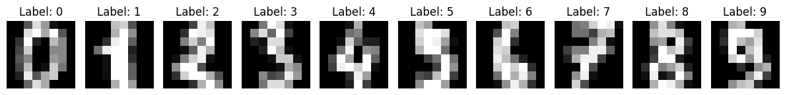
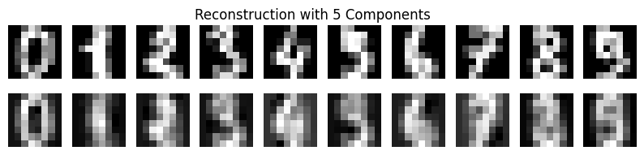
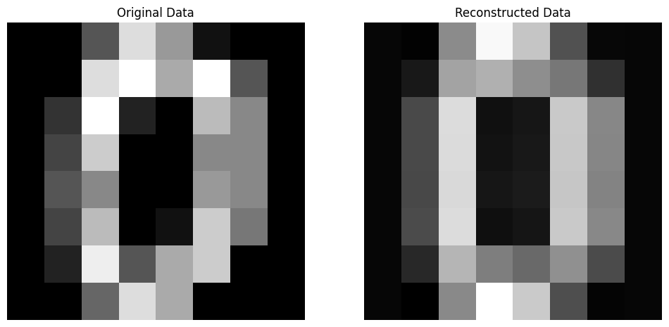

# 使用 Scikit-learn 实现 PCA

使用Scikit-learn库执行PCA过程以对数字数据进行降维。然后比较原始数据和重构数据之间的差异。

### 输入数据
导入库，并可视化源输入数据。


```python
# 导入所需的库
import numpy as np
import matplotlib.pyplot as plt
from sklearn.datasets import load_digits
from sklearn.decomposition import PCA
from sklearn.metrics import mean_squared_error
```


```python
# 加载数字数据集
digits = load_digits()
X = digits.data
y = digits.target

# 计算原始数据大小
original_size = X.nbytes / (1024 * 1024)  # in megabytes
print("original data size is: %.2f MB" % original_size)
```

    original data size is: 0.88 MB


```python
# 将前10个样本作为图像显示
fig, axes = plt.subplots(1, 10, figsize=(12, 4))
for i in range(10):
    axes[i].imshow(X[i].reshape(8, 8), cmap='gray')
    axes[i].set_title(f"Label: {y[i]}")
    axes[i].axis('off')
plt.tight_layout()
plt.show()
```


    

    


### 重建结果

定义函数以计算重构误差和执行PCA


```python
# Function to calculate reconstruction error
def reconstruction_error(original, reconstructed):
    return mean_squared_error(original, reconstructed)

# 函数用于执行PCA并使用n_components重构数据。
def perform_pca(n_components):
    pca = PCA(n_components=n_components)
    X_pca = pca.fit_transform(X)
    X_reconstructed = pca.inverse_transform(X_pca)
    return X_reconstructed, pca
```


```python
# 执行PCA，并可视化结果
def analyze_pca(n_components):
    X_reconstructed, pca = perform_pca(n_components)
    reconstruction_error_val = reconstruction_error(X, X_reconstructed)
    print(f"Number of Components: {n_components}, Reconstruction Error: {reconstruction_error_val}")

    # 压缩文件的大小
    compressed_size = (pca.components_.nbytes + pca.mean_.nbytes + X_reconstructed.nbytes) / (1024 * 1024)  # in megabytes
    print(f"Size of Compressed File: {compressed_size} MB")

    # 大小差异
    size_difference = original_size - compressed_size
    print(f"Difference in Size: {size_difference} MB")

    # 绘制每个数字的原始和重构图像
    fig, axes = plt.subplots(2, 10, figsize=(10, 2))
    for digit in range(10):
        digit_indices = np.where(y == digit)[0]  # Indices of samples with the current digit
        original_matrix = X[digit_indices[0]].reshape(8, 8)  # Take the first sample for each digit
        reconstructed_matrix = np.round(X_reconstructed[digit_indices[0]].reshape(8, 8), 1)  # Round to one decimal place
        axes[0, digit].imshow(original_matrix, cmap='gray')
        axes[0, digit].axis('off')
        axes[1, digit].imshow(reconstructed_matrix, cmap='gray')
        axes[1, digit].axis('off')

    plt.suptitle(f'Reconstruction with {n_components} Components')
    plt.show()

    # 打印第一个数据的原始矩阵
    print("Original Matrix of the First Data:")
    print(original_matrix)

    # 打印重构矩阵
    print("\nReconstruction Matrix of the First Data:")
    print(reconstructed_matrix)

```

分析使用一个主成分时的结果

```python
analyze_pca(1)
```

    Number of Components: 1, Reconstruction Error: 15.977678462238496
    Size of Compressed File: 0.87841796875 MB
    Difference in Size: -0.0009765625 MB


    

    


    Original Matrix of the First Data:
    [[ 0.  0. 11. 12.  0.  0.  0.  0.]
     [ 0.  2. 16. 16. 16. 13.  0.  0.]
     [ 0.  3. 16. 12. 10. 14.  0.  0.]
     [ 0.  1. 16.  1. 12. 15.  0.  0.]
     [ 0.  0. 13. 16.  9. 15.  2.  0.]
     [ 0.  0.  0.  3.  0.  9. 11.  0.]
     [ 0.  0.  0.  0.  9. 15.  4.  0.]
     [ 0.  0.  9. 12. 13.  3.  0.  0.]]
    
    Reconstruction Matrix of the First Data:
    [[-0.   0.4  6.4 12.6 12.   6.3  1.4  0.1]
     [ 0.   2.6 11.7 11.2 10.5  9.4  1.9  0.1]
     [ 0.   3.   9.4  5.8  8.   8.7  1.6  0. ]
     [ 0.   2.1  7.7  9.  11.1  7.8  2.   0. ]
     [ 0.   1.5  5.6  8.2  9.8  8.5  2.8  0. ]
     [ 0.   1.   5.2  5.9  6.5  8.2  3.7  0. ]
     [ 0.   0.8  7.8  9.   8.8  9.5  4.1  0.2]
     [ 0.   0.4  6.8 12.9 11.9  7.3  2.3  0.4]]


分析使用五个主成分时的结果


```python
analyze_pca(5)
```

    Number of Components: 5, Reconstruction Error: 8.542447616249266
    Size of Compressed File: 0.88037109375 MB
    Difference in Size: -0.0029296875 MB


    

    


    Original Matrix of the First Data:
    [[ 0.  0. 11. 12.  0.  0.  0.  0.]
     [ 0.  2. 16. 16. 16. 13.  0.  0.]
     [ 0.  3. 16. 12. 10. 14.  0.  0.]
     [ 0.  1. 16.  1. 12. 15.  0.  0.]
     [ 0.  0. 13. 16.  9. 15.  2.  0.]
     [ 0.  0.  0.  3.  0.  9. 11.  0.]
     [ 0.  0.  0.  0.  9. 15.  4.  0.]
     [ 0.  0.  9. 12. 13.  3.  0.  0.]]
    
    Reconstruction Matrix of the First Data:
    [[ 0.   0.2  5.2 11.1 12.1  7.   1.6  0.1]
     [ 0.   2.1 11.2 10.7  9.7  9.6  2.3  0.2]
     [ 0.   3.1 11.2  6.2  6.   9.2  2.5  0.1]
     [ 0.   3.1 10.3  9.   9.6  9.6  2.9  0. ]
     [ 0.   2.2  6.   5.3  8.  11.6  3.9  0. ]
     [ 0.   1.2  4.2  1.9  4.9 11.7  5.1  0. ]
     [ 0.   0.6  6.7  6.2  8.8 12.1  4.4  0.2]
     [ 0.   0.2  5.4 12.1 13.4  8.2  1.8  0.3]]


使用更多的主成分，重构结果会更好。接下来我们将手动计算PCA矩阵。

# 手动实现 PCA

手动逐步执行PCA分析。

### 输入数据

打印数据


```python
# 然后使用逐步的方法计算PCA步骤；
# 取第一个数据点进行分析
first_data = X[0]
print("Raw input data: \n", X[0])
# 将数据点重新整形为二维数组（图像）
input_matrix = first_data.reshape(8, 8)

print("Input matrix: ")
for row in input_matrix:
    print(" ".join(f"{val:4.0f}" for val in row))

# 打印原始矩阵（图像）
plt.imshow(input_matrix, cmap='gray')
plt.title("Input matrix (Image)")
plt.axis('off')
plt.show()
```

    Raw input data: 
     [ 0.  0.  5. 13.  9.  1.  0.  0.  0.  0. 13. 15. 10. 15.  5.  0.  0.  3.
     15.  2.  0. 11.  8.  0.  0.  4. 12.  0.  0.  8.  8.  0.  0.  5.  8.  0.
      0.  9.  8.  0.  0.  4. 11.  0.  1. 12.  7.  0.  0.  2. 14.  5. 10. 12.
      0.  0.  0.  0.  6. 13. 10.  0.  0.  0.]
    Raw data shape:  (64,)
    Input matrix: 
       0    0    5   13    9    1    0    0
       0    0   13   15   10   15    5    0
       0    3   15    2    0   11    8    0
       0    4   12    0    0    8    8    0
       0    5    8    0    0    9    8    0
       0    4   11    0    1   12    7    0
       0    2   14    5   10   12    0    0
       0    0    6   13   10    0    0    0


    

    


### 居中数据

这个均值计算有助于我们理解每个特征的平均值，这对于居中数据和在随后的步骤中计算协方差矩阵至关重要。
居中数据是PCA中的关键预处理步骤，它增强了结果的解释性，消除了偏差，并确保了计算中的数值稳定性。


```python
# 步骤1：计算每个特征（列）的均值
mean_vec = np.mean(input_matrix, axis=0)
print(mean_vec)
```

    [ 0.    2.25 10.5   6.    5.    8.5   4.5   0.  ]


```python
# 步骤2：从每个特征中减去均值
centered_matrix = input_matrix - mean_vec
print(centered_matrix)
```

    [[ 0.   -2.25 -5.5   7.    4.   -7.5  -4.5   0.  ]
     [ 0.   -2.25  2.5   9.    5.    6.5   0.5   0.  ]
     [ 0.    0.75  4.5  -4.   -5.    2.5   3.5   0.  ]
     [ 0.    1.75  1.5  -6.   -5.   -0.5   3.5   0.  ]
     [ 0.    2.75 -2.5  -6.   -5.    0.5   3.5   0.  ]
     [ 0.    1.75  0.5  -6.   -4.    3.5   2.5   0.  ]
     [ 0.   -0.25  3.5  -1.    5.    3.5  -4.5   0.  ]
     [ 0.   -2.25 -4.5   7.    5.   -8.5  -4.5   0.  ]]


### 协方差计算

计算居中数据的协方差矩阵。


```python
# 使用np.dot计算协方差。Bessel修正在末尾减1。 https://www.uio.no/studier/emner/matnat/math/MAT4010/data/forelesningsnotater/bessel-s-correction---wikipedia.pdf
cov_matrix = np.dot(centered_matrix.T, centered_matrix) / (centered_matrix.shape[0] - 1) 

# 或者使用np.cov计算协方差
# cov_matrix = np.cov(centered_matrix, rowvar=False)

print(cov_matrix)
```

    [[  0.           0.           0.           0.           0.
        0.           0.           0.        ]
     [  0.           4.21428571   2.28571429 -13.14285714  -9.42857143
        4.14285714   6.14285714   0.        ]
     [  0.           2.28571429  14.          -9.42857143  -4.85714286
       17.           6.28571429   0.        ]
     [  0.         -13.14285714  -9.42857143  43.42857143  29.57142857
      -12.57142857 -17.85714286   0.        ]
     [  0.          -9.42857143  -4.85714286  29.57142857  26.
       -7.         -17.57142857   0.        ]
     [  0.           4.14285714  17.         -12.57142857  -7.
       28.85714286  11.           0.        ]
     [  0.           6.14285714   6.28571429 -17.85714286 -17.57142857
       11.          14.85714286   0.        ]
     [  0.           0.           0.           0.           0.
        0.           0.           0.        ]]


### 矩阵特征分解


```python
# 步骤4：计算协方差矩阵的特征值和特征向量
eigenvalues, eigenvectors = np.linalg.eig(cov_matrix)

print(eigenvalues)
print(eigenvectors)
```

    [8.92158455e+01 3.14545089e+01 7.61850164e+00 2.85144338e+00
     2.01453633e-01 1.53898738e-02 0.00000000e+00 0.00000000e+00]
    [[ 0.          0.          0.          0.          0.          0.
       1.          0.        ]
     [-0.20365153  0.09344175  0.07506402 -0.23052329 -0.41043409 -0.85003703
       0.          0.        ]
     [-0.22550077 -0.48188982  0.20855091  0.79993174 -0.1168451  -0.14104805
       0.          0.        ]
     [ 0.65318552 -0.28875672 -0.59464342  0.12374602  0.11324705 -0.32898247
       0.          0.        ]
     [ 0.48997693 -0.31860576  0.39448425 -0.20610464 -0.63307453  0.24399318
       0.          0.        ]
     [-0.33563583 -0.75773097 -0.0607778  -0.49775699  0.24837474  0.00681139
       0.          0.        ]
     [-0.35818338 -0.00212894 -0.66178497  0.03760326 -0.58531429  0.29955628
       0.          0.        ]
     [ 0.          0.          0.          0.          0.          0.
       0.          1.        ]]


选择与最大特征值对应的特征向量作为主成分。


```python
# 步骤5：选择与最大特征值对应的主成分
max_eigenvalue_index = np.argmax(eigenvalues)
principal_component = eigenvectors[:, max_eigenvalue_index]
print(principal_component)
```

    [ 0.         -0.20365153 -0.22550077  0.65318552  0.48997693 -0.33563583
     -0.35818338  0.        ]


```python
# 步骤6：将数据投影到主成分上
reduced_data = np.dot(centered_matrix, principal_component)

# 打印降维后的数据
print("Reduced data (1 principal component):\n", reduced_data)
```

    Reduced data (1 principal component):
     [12.35977044  5.86229378 -8.32285024 -8.14946302 -7.7867473  -8.41834525
      1.49545914 12.95988243]


到目前为止，数据已从 8x8 矩阵压缩为 8x1 向量。

### 重构数据

现在基于降维后的结果来重新组建原数据，并展示效果。


```python
# 步骤7：重构数据
reconstructed_data = np.dot(reduced_data.reshape(-1, 1), principal_component.reshape(1, -1))

# 步骤8：将均值添加回重构的数据
reconstructed_data += mean_vec

# 步骤9：可视化原始数据和重构数据
fig, axes = plt.subplots(1, 2, figsize=(12, 6))

# 原始数据
axes[0].imshow(input_matrix, cmap='gray')
axes[0].set_title('Original Data')
axes[0].axis('off')

# Reconstructed data
axes[1].imshow(reconstructed_data.real, cmap='gray')
axes[1].set_title('Reconstructed Data')
axes[1].axis('off')

plt.show()
```


    

    

