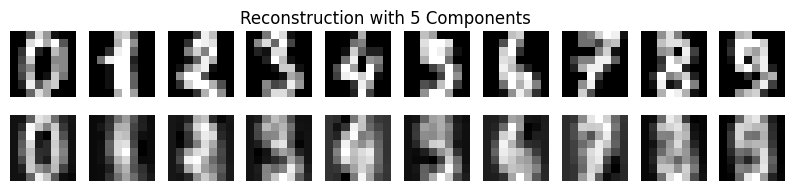
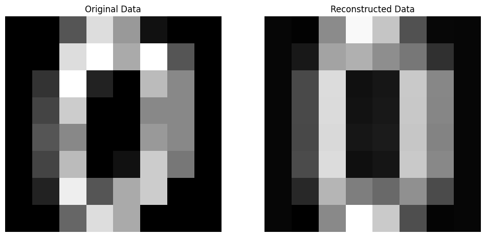

# PCA via Scikit-learn

Use scikit-learn lib to perform PCA process to digit data. To compare the origin and reconstruced data difference, have a overall understanding.

### Input Data
Import libs, and visualize the source input data.


```python
# Import needed libs
import numpy as np
import matplotlib.pyplot as plt
from sklearn.datasets import load_digits
from sklearn.decomposition import PCA
from sklearn.metrics import mean_squared_error
```


```python
# Load the digits dataset
digits = load_digits()
X = digits.data
y = digits.target

# Original data size
original_size = X.nbytes / (1024 * 1024)  # in megabytes
print("original data size is: %.2f MB" % original_size)
```

    original data size is: 0.88 MB


```python
# Plot the first 10 samples as images
fig, axes = plt.subplots(1, 10, figsize=(12, 4))
for i in range(10):
    axes[i].imshow(X[i].reshape(8, 8), cmap='gray')
    axes[i].set_title(f"Label: {y[i]}")
    axes[i].axis('off')
plt.tight_layout()
plt.show()
```


    

    


### Reconstruction Result

Define a series of function to perform reconstruction and reconstruction metric.


```python
# Function to calculate reconstruction error
def reconstruction_error(original, reconstructed):
    return mean_squared_error(original, reconstructed)

# Function to perform PCA and reconstruct data with n_components
def perform_pca(n_components):
    pca = PCA(n_components=n_components)
    X_pca = pca.fit_transform(X)
    X_reconstructed = pca.inverse_transform(X_pca)
    return X_reconstructed, pca
```


```python
# Function to perform PCA, and visualize result. Input is the number of principle components
def analyze_pca(n_components):
    X_reconstructed, pca = perform_pca(n_components)
    reconstruction_error_val = reconstruction_error(X, X_reconstructed)
    print(f"Number of Components: {n_components}, Reconstruction Error: {reconstruction_error_val}")

    # Size of compressed file
    compressed_size = (pca.components_.nbytes + pca.mean_.nbytes + X_reconstructed.nbytes) / (1024 * 1024)  # in megabytes
    print(f"Size of Compressed File: {compressed_size} MB")

    # Difference in size
    size_difference = original_size - compressed_size
    print(f"Difference in Size: {size_difference} MB")

    # Plot original and reconstructed images for each digit
    fig, axes = plt.subplots(2, 10, figsize=(10, 2))
    for digit in range(10):
        digit_indices = np.where(y == digit)[0]  # Indices of samples with the current digit
        original_matrix = X[digit_indices[0]].reshape(8, 8)  # Take the first sample for each digit
        reconstructed_matrix = np.round(X_reconstructed[digit_indices[0]].reshape(8, 8), 1)  # Round to one decimal place
        axes[0, digit].imshow(original_matrix, cmap='gray')
        axes[0, digit].axis('off')
        axes[1, digit].imshow(reconstructed_matrix, cmap='gray')
        axes[1, digit].axis('off')

    plt.suptitle(f'Reconstruction with {n_components} Components')
    plt.show()

    # Print the first data's matrix
    print("Original Matrix of the First Data:")
    print(original_matrix)

    # Print the reconstruction matrix
    print("\nReconstruction Matrix of the First Data:")
    print(reconstructed_matrix)

```

Analyze the result when we use one principle component


```python
analyze_pca(1)
```

    Number of Components: 1, Reconstruction Error: 15.977678462238496
    Size of Compressed File: 0.87841796875 MB
    Difference in Size: -0.0009765625 MB


    

    


    Original Matrix of the First Data:
    [[ 0.  0. 11. 12.  0.  0.  0.  0.]
     [ 0.  2. 16. 16. 16. 13.  0.  0.]
     [ 0.  3. 16. 12. 10. 14.  0.  0.]
     [ 0.  1. 16.  1. 12. 15.  0.  0.]
     [ 0.  0. 13. 16.  9. 15.  2.  0.]
     [ 0.  0.  0.  3.  0.  9. 11.  0.]
     [ 0.  0.  0.  0.  9. 15.  4.  0.]
     [ 0.  0.  9. 12. 13.  3.  0.  0.]]
    
    Reconstruction Matrix of the First Data:
    [[-0.   0.4  6.4 12.6 12.   6.3  1.4  0.1]
     [ 0.   2.6 11.7 11.2 10.5  9.4  1.9  0.1]
     [ 0.   3.   9.4  5.8  8.   8.7  1.6  0. ]
     [ 0.   2.1  7.7  9.  11.1  7.8  2.   0. ]
     [ 0.   1.5  5.6  8.2  9.8  8.5  2.8  0. ]
     [ 0.   1.   5.2  5.9  6.5  8.2  3.7  0. ]
     [ 0.   0.8  7.8  9.   8.8  9.5  4.1  0.2]
     [ 0.   0.4  6.8 12.9 11.9  7.3  2.3  0.4]]


Analyze when we choose 5 principle components.


```python
analyze_pca(5)
```

    Number of Components: 5, Reconstruction Error: 8.542447616249266
    Size of Compressed File: 0.88037109375 MB
    Difference in Size: -0.0029296875 MB


    

    


    Original Matrix of the First Data:
    [[ 0.  0. 11. 12.  0.  0.  0.  0.]
     [ 0.  2. 16. 16. 16. 13.  0.  0.]
     [ 0.  3. 16. 12. 10. 14.  0.  0.]
     [ 0.  1. 16.  1. 12. 15.  0.  0.]
     [ 0.  0. 13. 16.  9. 15.  2.  0.]
     [ 0.  0.  0.  3.  0.  9. 11.  0.]
     [ 0.  0.  0.  0.  9. 15.  4.  0.]
     [ 0.  0.  9. 12. 13.  3.  0.  0.]]
    
    Reconstruction Matrix of the First Data:
    [[ 0.   0.2  5.2 11.1 12.1  7.   1.6  0.1]
     [ 0.   2.1 11.2 10.7  9.7  9.6  2.3  0.2]
     [ 0.   3.1 11.2  6.2  6.   9.2  2.5  0.1]
     [ 0.   3.1 10.3  9.   9.6  9.6  2.9  0. ]
     [ 0.   2.2  6.   5.3  8.  11.6  3.9  0. ]
     [ 0.   1.2  4.2  1.9  4.9 11.7  5.1  0. ]
     [ 0.   0.6  6.7  6.2  8.8 12.1  4.4  0.2]
     [ 0.   0.2  5.4 12.1 13.4  8.2  1.8  0.3]]


The more the principle components used, the better the reconstruction result. Next we will mannualy compute the PCA matrix.

# Manual PCA

Maunal step-by-step way to perform the PCA analysis.

### Input Data

Show the input data.


```python
# Then use step-by-step wat to calculate the PCA steps;
# Take the first data point for analysis
first_data = X[0]
print("Raw input data: \n", X[0])
# Reshape the data point into a 2D array (image)
input_matrix = first_data.reshape(8, 8)

print("Input matrix: ")
for row in input_matrix:
    print(" ".join(f"{val:4.0f}" for val in row))

# Print the original matrix (image)
plt.imshow(input_matrix, cmap='gray')
plt.title("Input matrix (Image)")
plt.axis('off')
plt.show()
```

    Raw input data: 
     [ 0.  0.  5. 13.  9.  1.  0.  0.  0.  0. 13. 15. 10. 15.  5.  0.  0.  3.
     15.  2.  0. 11.  8.  0.  0.  4. 12.  0.  0.  8.  8.  0.  0.  5.  8.  0.
      0.  9.  8.  0.  0.  4. 11.  0.  1. 12.  7.  0.  0.  2. 14.  5. 10. 12.
      0.  0.  0.  0.  6. 13. 10.  0.  0.  0.]
    Raw data shape:  (64,)
    Input matrix: 
       0    0    5   13    9    1    0    0
       0    0   13   15   10   15    5    0
       0    3   15    2    0   11    8    0
       0    4   12    0    0    8    8    0
       0    5    8    0    0    9    8    0
       0    4   11    0    1   12    7    0
       0    2   14    5   10   12    0    0
       0    0    6   13   10    0    0    0


    

    


### Centering the Data

This mean calculation helps us understand the average value of each feature, which is essential for centering the data and calculating the covariance matrix in subsequent steps.
centering the data is a crucial preprocessing step in PCA that enhances the interpretability of the results, removes bias, and ensures numerical stability in computations.


```python
# Step 1: Calculate the mean of each feature (column)
mean_vec = np.mean(input_matrix, axis=0)
print(mean_vec)
```

    [ 0.    2.25 10.5   6.    5.    8.5   4.5   0.  ]


```python
# Step 2: Subtract the mean from each feature
centered_matrix = input_matrix - mean_vec
print(centered_matrix)
```

    [[ 0.   -2.25 -5.5   7.    4.   -7.5  -4.5   0.  ]
     [ 0.   -2.25  2.5   9.    5.    6.5   0.5   0.  ]
     [ 0.    0.75  4.5  -4.   -5.    2.5   3.5   0.  ]
     [ 0.    1.75  1.5  -6.   -5.   -0.5   3.5   0.  ]
     [ 0.    2.75 -2.5  -6.   -5.    0.5   3.5   0.  ]
     [ 0.    1.75  0.5  -6.   -4.    3.5   2.5   0.  ]
     [ 0.   -0.25  3.5  -1.    5.    3.5  -4.5   0.  ]
     [ 0.   -2.25 -4.5   7.    5.   -8.5  -4.5   0.  ]]


### Covariance Calculation

Calculate the Covariance matrix of centered data.


```python
# Calculate covariance using np.dot. Bessel's correction to minus 1 at the end. https://www.uio.no/studier/emner/matnat/math/MAT4010/data/forelesningsnotater/bessel-s-correction---wikipedia.pdf
cov_matrix = np.dot(centered_matrix.T, centered_matrix) / (centered_matrix.shape[0] - 1) 

# Or calculate covariance using np.cov
# cov_matrix = np.cov(centered_matrix, rowvar=False)

print(cov_matrix)
```

    [[  0.           0.           0.           0.           0.
        0.           0.           0.        ]
     [  0.           4.21428571   2.28571429 -13.14285714  -9.42857143
        4.14285714   6.14285714   0.        ]
     [  0.           2.28571429  14.          -9.42857143  -4.85714286
       17.           6.28571429   0.        ]
     [  0.         -13.14285714  -9.42857143  43.42857143  29.57142857
      -12.57142857 -17.85714286   0.        ]
     [  0.          -9.42857143  -4.85714286  29.57142857  26.
       -7.         -17.57142857   0.        ]
     [  0.           4.14285714  17.         -12.57142857  -7.
       28.85714286  11.           0.        ]
     [  0.           6.14285714   6.28571429 -17.85714286 -17.57142857
       11.          14.85714286   0.        ]
     [  0.           0.           0.           0.           0.
        0.           0.           0.        ]]


### Eigen decomposition


```python
# Step 4: Compute the eigenvalues and eigenvectors of the covariance matrix
eigenvalues, eigenvectors = np.linalg.eig(cov_matrix)

print(eigenvalues)
print(eigenvectors)
```

    [8.92158455e+01 3.14545089e+01 7.61850164e+00 2.85144338e+00
     2.01453633e-01 1.53898738e-02 0.00000000e+00 0.00000000e+00]
    [[ 0.          0.          0.          0.          0.          0.
       1.          0.        ]
     [-0.20365153  0.09344175  0.07506402 -0.23052329 -0.41043409 -0.85003703
       0.          0.        ]
     [-0.22550077 -0.48188982  0.20855091  0.79993174 -0.1168451  -0.14104805
       0.          0.        ]
     [ 0.65318552 -0.28875672 -0.59464342  0.12374602  0.11324705 -0.32898247
       0.          0.        ]
     [ 0.48997693 -0.31860576  0.39448425 -0.20610464 -0.63307453  0.24399318
       0.          0.        ]
     [-0.33563583 -0.75773097 -0.0607778  -0.49775699  0.24837474  0.00681139
       0.          0.        ]
     [-0.35818338 -0.00212894 -0.66178497  0.03760326 -0.58531429  0.29955628
       0.          0.        ]
     [ 0.          0.          0.          0.          0.          0.
       0.          1.        ]]


Select the principal component corresponding to the maximum eigenvalue


```python
# Step 5: Choose the principal component corresponding to the maximum eigenvalue
max_eigenvalue_index = np.argmax(eigenvalues)
principal_component = eigenvectors[:, max_eigenvalue_index]
print(principal_component)
```

    [ 0.         -0.20365153 -0.22550077  0.65318552  0.48997693 -0.33563583
     -0.35818338  0.        ]


```python
# Step 6: Project the data onto the principal component
reduced_data = np.dot(centered_matrix, principal_component)

# Print the reduced data
print("Reduced data (1 principal component):\n", reduced_data)
```

    Reduced data (1 principal component):
     [12.35977044  5.86229378 -8.32285024 -8.14946302 -7.7867473  -8.41834525
      1.49545914 12.95988243]


So far, the data is compressed from 8x8 matrix to 8x1 vector.

### Reconstruction

Now reconstruc the data based on the reduced data.


```python
# Step 7: Reconstruct the data
reconstructed_data = np.dot(reduced_data.reshape(-1, 1), principal_component.reshape(1, -1))

# Step 8: Add back the mean to the reconstructed data
reconstructed_data += mean_vec

# Step 9: Visualize the original and reconstructed data
fig, axes = plt.subplots(1, 2, figsize=(12, 6))

# Original data
axes[0].imshow(input_matrix, cmap='gray')
axes[0].set_title('Original Data')
axes[0].axis('off')

# Reconstructed data
axes[1].imshow(reconstructed_data.real, cmap='gray')
axes[1].set_title('Reconstructed Data')
axes[1].axis('off')

plt.show()
```


    

    

