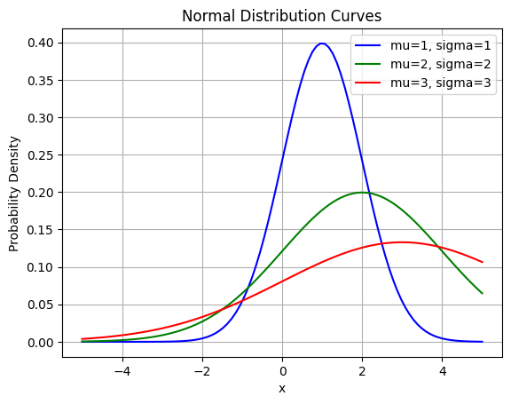
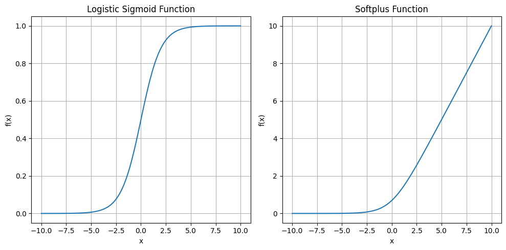

```python
import numpy as np
import matplotlib.pyplot as plt

# Parameters for the normal distributions
mu_values = [1, 2, 3]  # Mean values
sigma_values = [1, 2, 3]  # Standard deviation values
colors = ['blue', 'green', 'red']  # Colors for plotting

# Generate data points for the x-axis
x = np.linspace(-5, 5, 100)

# Plot each normal distribution curve
for mu, sigma, color in zip(mu_values, sigma_values, colors):
    # Calculate the probability density function (PDF) for each data point
    pdf = 1/(sigma * np.sqrt(2*np.pi)) * np.exp(-0.5 * ((x - mu)/sigma)**2)
    
    # Plot the normal distribution curve
    plt.plot(x, pdf, color=color, label=f'mu={mu}, sigma={sigma}')

plt.title('Normal Distribution Curves')
plt.xlabel('x')
plt.ylabel('Probability Density')
plt.grid(True)
plt.legend()
plt.show()
```


    

    


```python
# Define the logistic sigmoid function
def sigmoid(x):
    return 1 / (1 + np.exp(-x))

# Define the softplus function
def softplus(x):
    return np.log(1 + np.exp(x))

# Generate x values
x = np.linspace(-10, 10, 100)

# Calculate y values using the sigmoid and softplus functions
y_sigmoid = sigmoid(x)
y_softplus = softplus(x)

# Plot both functions in separate subplots
plt.figure(figsize=(10, 5))

# Plot for logistic sigmoid
plt.subplot(1, 2, 1)
plt.plot(x, y_sigmoid)
plt.title('Logistic Sigmoid Function')
plt.xlabel('x')
plt.ylabel('f(x)')
plt.grid(True)

# Plot for softplus
plt.subplot(1, 2, 2)
plt.plot(x, y_softplus)
plt.title('Softplus Function')
plt.xlabel('x')
plt.ylabel('f(x)')
plt.grid(True)

plt.tight_layout()
plt.show()
```


    

    

